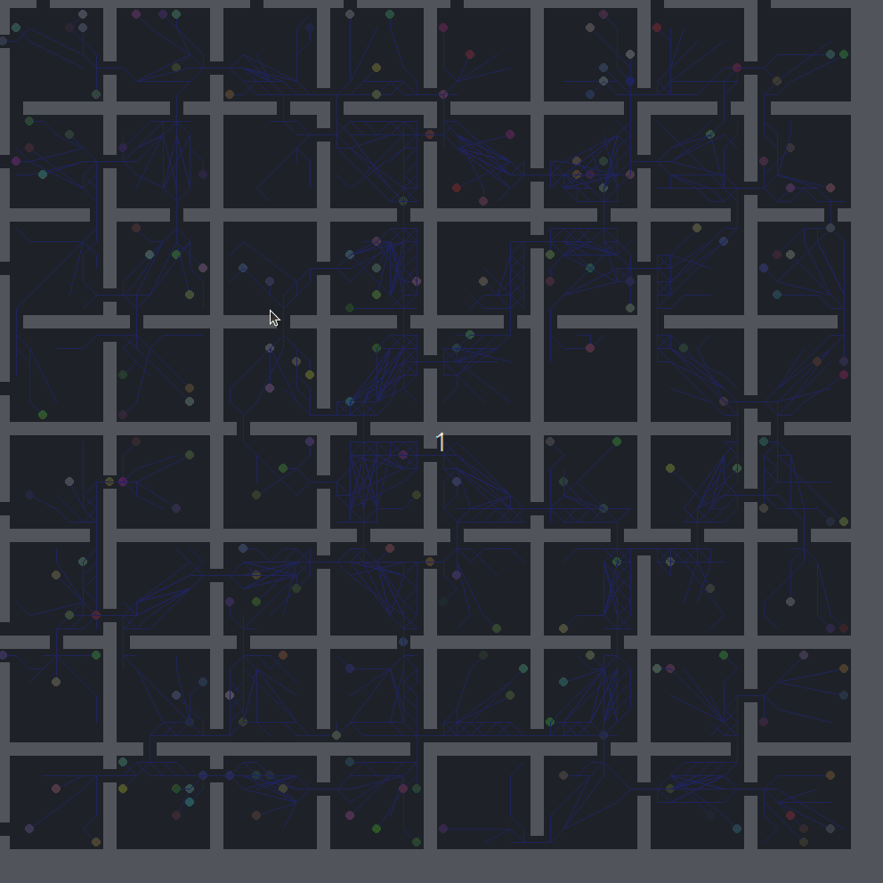
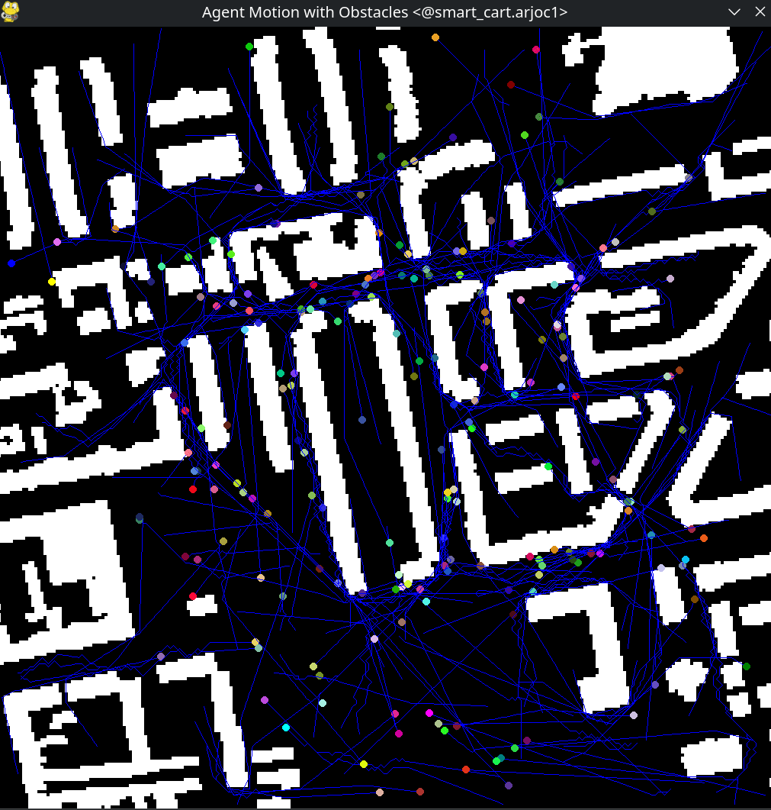

# pypibt

This repo consists of two extensions to PiBT. The
first is a path smoother which is able to take pibt
and extend it to free space, while the second is a
version of PiBT that works on heterogenous fleets.
It is based on Keisuke Okumura's original python pypibt implementation.

# Development
To start developing this workspace use poetry:
```
poetry install
```

# Free-Space Path Smoothing for PiBT




This set of experiments explores a post-hoc path smoothing solution for MAPF
in free space. To run a demo first run PiBT using the following command:

```
poetry run python app.py -m assets/Berlin_1_256.map -i assets/Berlin_1_256-random-1.scen -N 200
```

Then run the smoothing+visuallization tool:
```
poetry run python vis.py assets/Berlin_1_256.map
```
The full mapf benchmarks can be found here: https://movingai.com/benchmarks/mapf/index.html

If you use this work in an academic setting consider citing:
```

```
