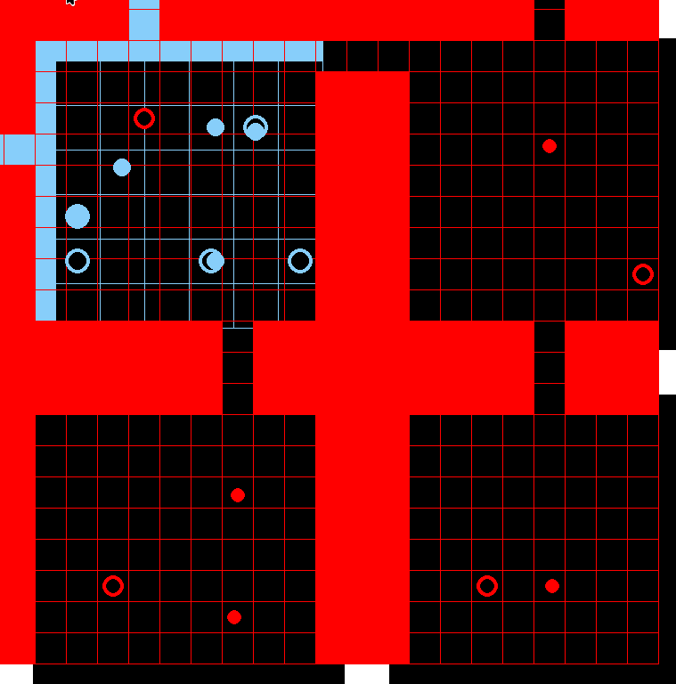

# HetPiBT

This is an extension to PiBT. This extension enables us to plan around heterogenous systems.
The idea is that different robots may move at different paces and have different sizes, we use a simple
precomputed collision cache to reason over the different robots.

## Benchmarking Methodology

After some survey, we determined we don't yet have a good set of benchmarks for heterogenous fleets. We reuse the MAPF
benchmarks for maps however we generate synthetic scenarios. Each scenario grid map gets projected onto each robot's nav-graph.
Subsequently in order to generate valid agent paths we randomly select start positions for agents and then add end goals for agents.
To ensure that the scenarios can actually be solved, we rely on a priority scheme.

## Some cool demos
Here we have a bunch of robots with different sizes anddynamics. The blue robots are bigger and move faster while the red robots are smaller and move more slowly, we show that HetPiBT correctly routes the individual vehicles in a safe manner.

## Observations and Conclusions

While HetPiBT is fast, it can generate really suboptimal paths and introduce additional movements where unecessary.
Using PiBT alone for heterogenous search is not a bad idea, but it needs a higher level of optimization to prevent unwanted osscillations.